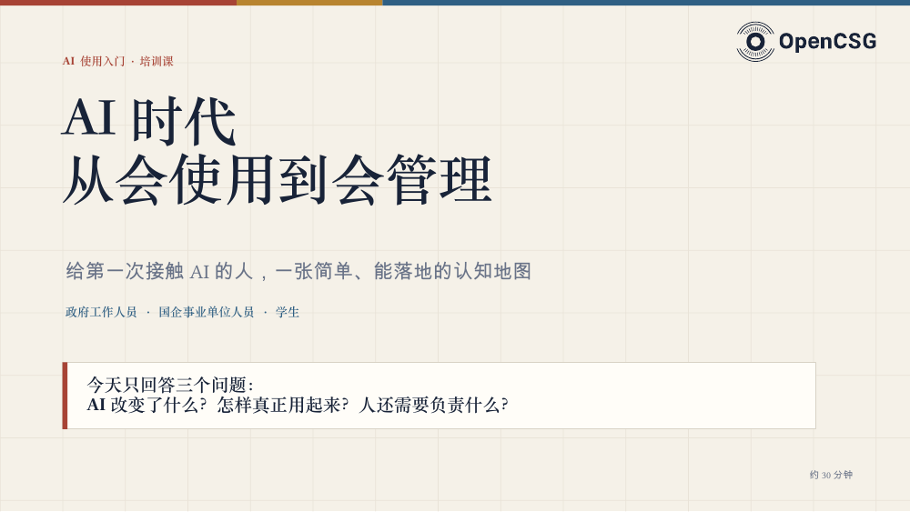

# AI 使用入门培训

AI 时代：从会使用到会管理

陈一豪 / Ethan · 2026 年 8 月 · v0.3 历史课件 · 17 页

[PDF 预览与下载](slides.pdf) · [PowerPoint 下载](slides.pptx) · [返回课件目录](../README.md)

围绕 AI 改变了什么、大模型与智能体如何协作，以及人如何交代任务、检查结果，建立一张入门认知地图。

## 内容提纲

- AI 与技术变化：放大部分认知劳动
- 大模型、智能体与数字团队
- 目标、背景、资料、输出、验收和边界
- 业务化、管理与学习三项能力
- 从一个真实小任务开始实践

## 版本说明

原始文件名：`AI使用入门培训_培训PPT_v0.3.pptx`。本公开副本于 2026-09-26 整理：原页序、正文、版式、图片及教学备注保持；统一文件作者属性，删除备注中引用的本机目录前缀。PDF 从同一公开 PPTX 导出。

这些是历史课件，产品名称、功能与入口应以相应官方当前说明为准。封面时间或课堂流程不作为活动已举办、效果已验证或报名正在开放的证明。

原创文字适用 [CC BY 4.0](../../LICENSE)；OpenCSG 标志、产品名称、引用及其他第三方材料保留各自权利，不能据此代表品牌背书。详见 [课件使用说明](../README.md)。
