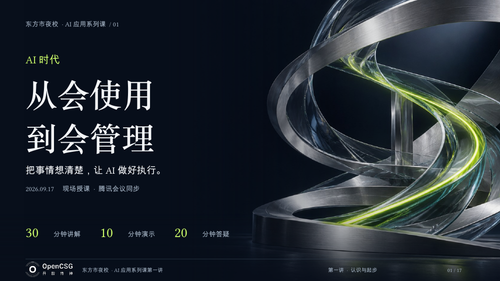

# 东方市夜校 · AI 第一课

认识 AI，把事情交代清楚

陈一豪 / Ethan · 封面日期 2026.09.17 · 17 页版本

[PDF 预览与下载](slides.pdf) · [PowerPoint 下载](slides.pptx) · [返回课件目录](../README.md)

面向初次接触 AI 的读者，用熟悉的办公任务理解模型、智能体、任务说明与结果判断，配合演示和课后练习。

## 内容提纲

- 从熟悉的一件事理解 AI
- 大模型、智能体与 OPC 的教学类比
- 业务判断、任务管理与实践学习
- 背景、目标、资料、要求四项任务单
- 方案演示、交流答疑与课后尝试

## 版本说明

原始文件名：`东方市夜校_AI第一课_深色科技_17页_白色页脚Logo.pptx`。本公开副本于 2026-09-26 整理：原页序、正文、版式、图片及教学备注保持；统一文件作者属性。PDF 从同一公开 PPTX 导出。夜校课件选用无个人二维码的17页版本，不是19页扫码交流版。

这些是历史课件，产品名称、功能与入口应以相应官方当前说明为准。封面时间或课堂流程不作为活动已举办、效果已验证或报名正在开放的证明。

原创文字适用 [CC BY 4.0](../../LICENSE)；OpenCSG 标志、产品名称、引用及其他第三方材料保留各自权利，不能据此代表品牌背书。详见 [课件使用说明](../README.md)。
